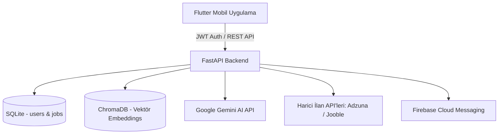

# 🔍 CareerLens AI — Akıllı CV ve Kariyer Eşleştirme Platformu

[](https://flutter.dev)
[](https://fastapi.tiangolo.com)
[](https://python.org)
[](https://www.trychroma.com)
[](https://aistudio.google.com)

**CareerLens AI**, adayların PDF formatındaki özgeçmişlerini derinlemesine analiz eden, yapay zeka ve semantik vektör araması ile en uygun iş ilanlarıyla eşleştiren, ATS (Aday Takip Sistemi) uyum skoru hesaplayan ve Türkçe STAR formatında kişiselleştirilmiş kariyer koçluğu sunan yeni nesil bir kariyer asistanıdır.

---

## 🌟 Temel Özellikler

- 📄 **Akıllı PDF CV Ayrıştırma:**
  - Güvenli PDF başlık doğrulaması (Magic bytes `%PDF-`) ve dosya boyutu sınırı (Max 10MB).
  - PyMuPDF tabanlı metin çıkarımı ve hibrit yetenek tanıma (Google Gemini Flash + Genişletilmiş Regex Fallback).
- 🎯 **Hibrit ATS Puanlama Algoritması:**
  - **%60 Semantik Uyum:** `paraphrase-multilingual-MiniLM-L12-v2` embedding modeli ve ChromaDB kosinüs benzerliği.
  - **%40 Anahtar Kelime & Yetenek Eşleşmesi:** Aday yetenekleri ile ilan gereksinimleri arasındaki doğrudan küme kesişimi.
- 💼 **Çok Kaynaklı Gerçek İlan Entegrasyonu:**
  - Adzuna, Jooble ve Careerjet API'leri üzerinden otomatik ilan çekme.
  - SQLite üzerinde 2.900+ hazır iş ilanı ve arka plan cron senkronizasyonu (`APScheduler`).
- 🤖 **Yapay Zeka Destekli Kariyer Koçu:**
  - Gemini API tabanlı Türkçe koçluk analizi.
  - **STAR Metodolojisi** (Situation, Task, Action, Result) ile CV madde önerileri ve proje tavsiyeleri.
- 🔐 **Kullanıcı Kimlik Doğrulama (JWT Auth):**
  - PBKDF2-HMAC-SHA256 parola hashleme (NIST standartlarında salt + timing attack koruması).
  - Güvenli JWT Bearer token ile oturum yönetimi.
- 📱 **Modern Flutter Mobil Deneyimi:**
  - Bento Grid tasarım dili, dinamik Yetenek Radarı grafiği, açık/koyu tema ve çoklu dil desteği.
  - `SharedPreferences` ile çevrimdışı CV ve yetenek senkronizasyonu.
- 🔔 **Gerçek Zamanlı Bildirimler (FCM):**
  - Firebase Cloud Messaging entegrasyonu ile yüksek uyumlu ilan bildirimleri.

---

## 🏛️ Sistem Mimarisi



Detaylı mimari rapor için: [`architecture/SYSTEM_ARCHITECTURE.md`](architecture/SYSTEM_ARCHITECTURE.md)  
Detaylı API dokümantasyonu için: [`docs/API_DOCUMENTATION.md`](docs/API_DOCUMENTATION.md)

---

## 🚀 Hızlı Başlangıç & Kurulum

### 1. Gereksinimler
- Python 3.11 veya üzeri
- Flutter SDK 3.29+ & Dart 3.7+
- Android Studio / Android SDK (Emülatör veya fiziksel cihaz)

---

### 2. Backend Kurulumu

```bash
# Backend dizinine gidin
cd backend

# Sanal ortam oluşturun ve aktif edin
python -m venv venv
# Windows:
.\venv\Scripts\activate
# Linux/macOS:
source venv/bin/activate

# Bağımlılıkları yükleyin
pip install -r requirements.txt

# Çevre değişkenlerini ayarlayın (.env.example dosyasını .env olarak kopyalayın)
cp .env.example .env
```

`.env` dosyanızı açıp geçerli anahtarlarınızı girin:
```env
GEMINI_API_KEY=your_gemini_api_key
ADZUNA_APP_ID=your_adzuna_app_id
ADZUNA_APP_KEY=your_adzuna_app_key
```

Backend sunucusunu başlatın:
```bash
uvicorn app.main:app --reload --host 0.0.0.0 --port 8000
```
Sunucu ayağa kalktığında Swagger arayüzüne `http://127.0.0.1:8000/docs` adresinden erişebilirsiniz.

---

### 3. Flutter Mobil Uygulama Kurulumu

```bash
# mobile_app dizinine gidin
cd mobile_app

# Bağımlılıkları çekin
flutter pub get

# Kod analizini çalıştırın (0 Hata / Uyarı)
flutter analyze

# Bağlı emülatör veya cihazda çalıştırın
flutter run
```

> **Not:** Android Emülatörü localhost'a erişirken `10.0.2.2:8000` adresini kullanır. Uygulama içinde API baseUrl buna göre yapılandırılmıştır.

---

## 🧪 Test Hesapları & Veritabanı Seed

Sistemi anında test edebilmeniz için hazır seed kullanıcıları bulunmaktadır:

| E-Posta | Şifre | Rol |
| :--- | :--- | :--- |
| `demo@careerlens.ai` | `Demo1234!` | Standart Kullanıcı |
| `esra@careerlens.ai` | `Esra1234!` | Standart Kullanıcı |

Yeni kullanıcı kaydı oluşturmak için doğrudan mobil uygulamadaki "Kayıt Ol" ekranını kullanabilir veya Swagger (`POST /api/v1/auth/register`) üzerinden test edebilirsiniz.

---

## 🛡️ Güvenlik & Gizlilik Notları

- `.env`, `firebase-adminsdk.json`, `fcm_token.txt` ve kullanıcı CV verileri `.gitignore` ile korunmaktadır.
- Kesinlikle özel API anahtarlarını veya Firebase service account dosyalarını commit etmeyiniz.

