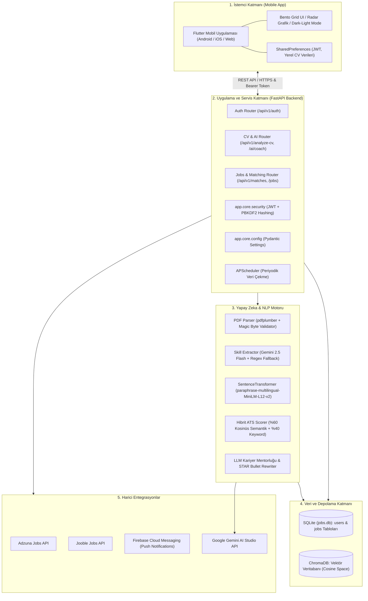
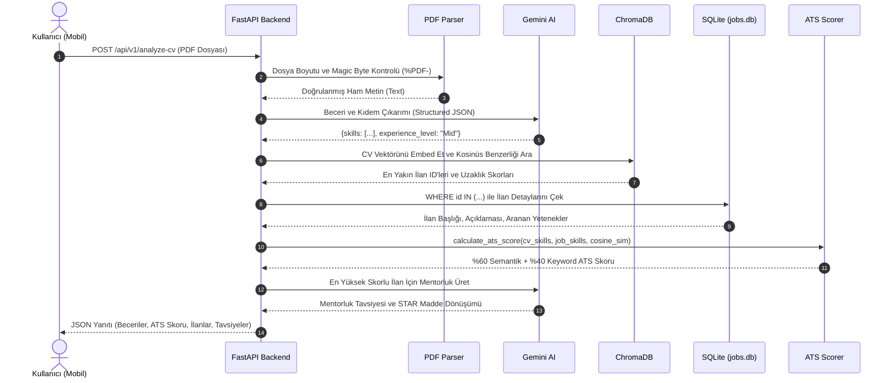

# 🏗️ CareerLens AI — Sistem Mimarisi ve Tasarım Dokümanı

Bu doküman, **CareerLens AI** projesinin katmanlı mimarisini, veri akışlarını, yapay zeka eşleştirme motorunu ve güvenlik altyapısını detaylandırmaktadır. Bu döküman staj raporları ve teknik sunumlar için referans niteliğindedir.

---

## 1. Genel Sistem Mimarisi

CareerLens AI, modern bir **İstemci-Sunucu (Client-Server)** mimarisi üzerinde, Doğal Dil İşleme (NLP), Vektör Veritabanları ve Büyük Dil Modelleri (LLM) ile güçlendirilmiş hibrit bir platformdur.

---

## 2. Mimari Katmanların Sorumlulukları

| Katman | Teknoloji / Kütüphaneler | Sorumluluk |
| :--- | :--- | :--- |
| **Sunum (Presentation)** | Flutter, Material 3, fl_chart, Provider | Kullanıcı etkileşimi, dinamik filtreleme, CV yönetimi, radar grafikleri ve oturum durumu yönetimi. |
| **Uygulama (Application)** | FastAPI, Uvicorn, Pydantic | RESTful API endpoint'leri, girdi doğrulama, JWT kimlik denetimi ve hata yönetimi. |
| **Güvenlik (Security)** | PyJWT, hashlib (PBKDF2-SHA256), Secrets | NIST standardında parola hashleme, zamanlama saldırılarına dayanıklı karşılaştırma, JWT üretimi ve doğrulaması. |
| **NLP & Vektör Arama** | SentenceTransformers, ChromaDB, PyPDF | PDF'lerden metin çıkarma, çok dilli metin vektörleştirme ve kosinüs benzerliği ile en yakın iş ilanlarını getirme. |
| **LLM & Koçluk** | Google Gemini 2.5 Flash | Yapısal beceri çıkarımı, STAR tekniğiyle CV deneyim maddesi revizyonu ve acımasız teknik kariyer koçluğu. |
| **Kalıcılık (Persistence)** | SQLite3, ChromaDB Persistent | Kullanıcı hesapları, ham iş ilanları ve yüksek boyutlu vektör indeksleri. |

---

## 3. CV Yükleme ve Hibrit ATS Eşleştirme Veri Akışı

---

## 4. Hibrit ATS Skorlama Formülü

CareerLens AI, gerçek İK sistemlerinin (Applicant Tracking Systems) mantığını simüle eden iki bileşenli bir skorlama motoru kullanır:

$$\text{ATS Skoru} = \text{Semantik Skor (60 Puan)} + \text{Keyword Skoru (40 Puan)}$$

1. **Semantik Skor (0 - 60):**
   $$\text{Semantik Skor} = \max(0, \text{int}((1 - \text{Kosinüs Uzaklığı}) \times 60))$$
   Adayın CV'sindeki bağlamsal anlatım ile iş ilanının açıklaması arasındaki anlamsal yakınlığı ölçer.
2. **Keyword (Anahtar Kelime) Skoru (0 - 40):**
   $$\text{Keyword Skoru} = \text{int}\left(\frac{|\text{CV Becerileri} \cap \text{İlan Becerileri}|}{|\text{İlan Becerileri}|} \times 40\right)$$
   İlanda talep edilen zorunlu teknik teknolojilerin adayın özgeçmişinde birebir bulunma oranını ölçer.

---

## 5. Güvenlik ve Kimlik Doğrulama Mimarisi

- **Parola Güvenliği:** Parolalar veritabanında asla açık metin (plaintext) olarak saklanmaz. Her kullanıcı için rastgele 16 baytlık tuz (cryptographic salt) üretilir ve `PBKDF2-HMAC-SHA256` ile 100.000 iterasyondan geçirilir.
- **Zamanlama Saldırısı Koruması:** `secrets.compare_digest` kullanılarak hacker'ların harcanan süreden şifre tahmin etmesi (timing attack) engellenir.
- **Oturum Yönetimi (Stateless JWT):** Kullanıcı giriş yaptığında `HS256` ile imzalanmış bir JSON Web Token (JWT) üretilir. İstemci her istekte `Authorization: Bearer <token>` başlığı gönderir.
- **Dosya Yükleme Koruması:** Yüklenen dosyaların yalnızca dosya uzantısı değil, ilk baytlarındaki PDF imzası (`%PDF-`) kontrol edilir ve 10 MB dosya boyutu sınırı uygulanır.
