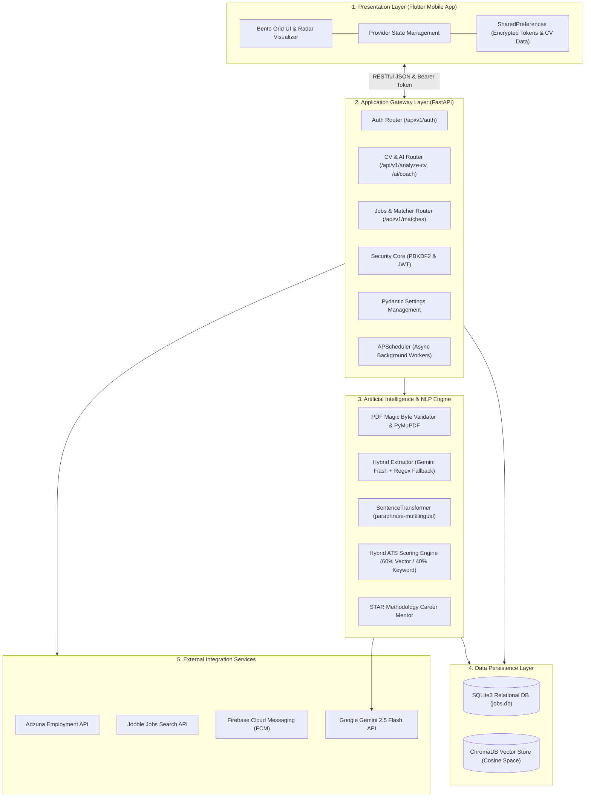
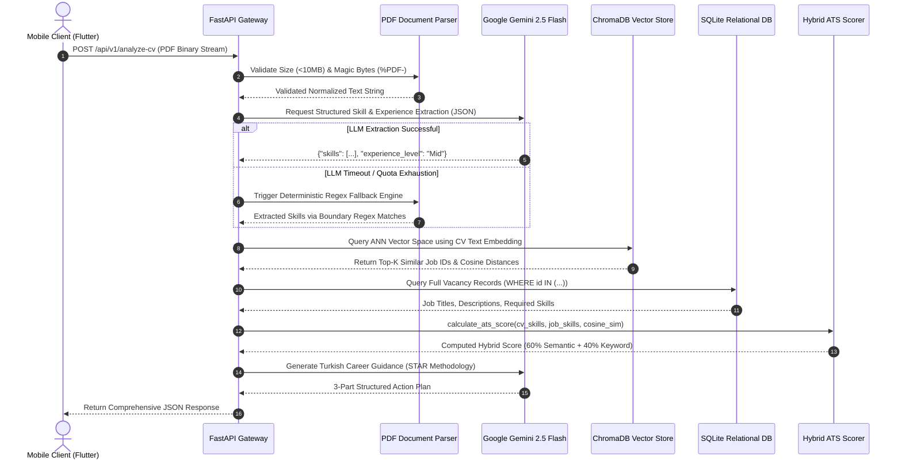

# DUZCE UNIVERSITY
# FACULTY OF ENGINEERING
# COMPUTER ENGINEERING DEPARTMENT

---

<br><br><br><br>

# INTERNSHIP REPORT
## CE399 / CE499 SUMMER INTERNSHIP

<br><br>

### **DEVELOPMENT OF AN AI-POWERED CAREER COACHING AND JOB MATCHING PLATFORM: CAREERLENS AI**

<br><br><br><br>

**Student Name & Surname:** Esra Kılıç  
**Student ID:** 221015004  
**Department:** Computer Engineering Department  
**Lecture Code:** CE399 / CE499  
**Internship Dates:** 24.08.2026 – 25.09.2026  
**Host Institution:** Ankara Bilgi Teknolojileri San. ve Tic. A.Ş. (AnkaraBT)  
**Location:** Farilya İş Merkezi, Kızılırmak Ufuk Ünv. Cad. No:8 Kat:11 Çankaya / Ankara, Türkiye  

<br><br><br><br><br><br>

---
<div style="page-break-after: always;"></div>

# TABLE OF CONTENTS

- **1. INTRODUCTION** ........................................................................................................ 1
- **2. INFORMATION ABOUT THE COMPANY** ................................................................ 3
  - 2.1 Company Profile and Contact Details .......................................................................... 3
  - 2.2 Fields of Activity and Technology Stacks .................................................................... 3
  - 2.3 Major Software Products and Corporate Solutions ....................................................... 4
  - 2.4 Department Structure, Human Resources, and Hardware Infrastructure ........................ 6
- **3. DESCRIPTION OF THE PROJECT AND THE WORK TO BE DONE** ....................... 8
  - 3.1 Problem Definition and Motivation ............................................................................. 8
  - 3.2 Objectives and Functional Scope .................................................................................. 9
  - 3.3 System Requirements and Architectural Constraints ................................................... 10
  - 3.4 Technology Stack Selection and Evaluation ................................................................ 11
- **4. PROJECT AND WORK DONE** ..................................................................................... 13
  - 4.1 Role and Engineering Responsibilities ........................................................................ 13
  - 4.2 System Architecture and High-Level Design ............................................................... 14
  - 4.3 Database Modeling and Data Persistence (SQLite & ChromaDB) ................................. 16
  - 4.4 Backend Engineering with FastAPI ............................................................................. 18
    - 4.4.1 Asynchronous Request Pipelines and Ingestion Architecture ................................. 18
    - 4.4.2 External Job Postings Ingestion Engine (Adzuna & Jooble) .................................... 19
    - 4.4.3 Cryptographic User Authentication (PBKDF2-HMAC-SHA256 & JWT) ............... 20
    - 4.4.4 PDF Security Verification and Magic Byte Inspection ........................................... 22
  - 4.5 Artificial Intelligence and Natural Language Processing Engine ................................. 23
    - 4.5.1 PDF Text Extraction Pipeline ............................................................................... 23
    - 4.5.2 Structured Skill Extraction with Gemini 2.5 Flash and Resilient Fallback .............. 24
    - 4.5.3 Vector Space Modeling and ChromaDB Semantic Search ..................................... 25
    - 4.5.4 Mathematical Formulation of the Hybrid ATS Scoring Model .............................. 27
    - 4.5.5 AI Career Coach and STAR Format Bullet Rewriting ............................................. 29
  - 4.6 Mobile Frontend Engineering with Flutter ................................................................... 31
    - 4.6.1 UI/UX Architecture and Bento Grid Design Language .......................................... 31
    - 4.6.2 State Management with Provider Architecture ...................................................... 32
    - 4.6.3 Local Persistence with SharedPreferences and Self-Healing Recovery .................. 33
    - 4.6.4 Dynamic Skill Radar Visualization ........................................................................ 35
    - 4.6.5 Asynchronous Lifecycle Guards and Mounted Context Safety .............................. 36
  - 4.7 Real-Time Push Notification Infrastructure (Firebase Cloud Messaging) .................... 38
  - 4.8 Testing, Debugging, and Code Quality Assurance ....................................................... 39
    - 4.8.1 Automated Backend Unit and Integration Testing .................................................. 39
    - 4.8.2 Flutter Static Analysis and Strict Lint Optimization ............................................... 41
    - 4.8.3 Root Cause Analysis and Troubleshooting Real-World Edge Cases ....................... 42
  - 4.9 Project Screen Outputs and User Interface Verification ............................................. 44
- **5. CONCLUSION** .............................................................................................................. 46
  - 5.1 Project Achievements and Engineering Evaluation .................................................... 46
  - 5.2 Technical Competencies and Professional Skills Gained ............................................. 47
  - 5.3 Future Work and Scalability Enhancements ................................................................ 48
- **6. APPENDICES** ................................................................................................................ 50
  - Appendix A: Flutter API Service and Authentication Client .............................................. 50
  - Appendix B: FastAPI Background Task Ingestion and Routing Logic ............................... 54
  - Appendix C: AI Prompt Engineering and Hybrid CV Extraction Service .......................... 57
  - Appendix D: ChromaDB Vector Indexing and Dynamic ATS Scorer ................................. 60
- **7. REFERENCES** ............................................................................................................... 63

---
<div style="page-break-after: always;"></div>

# 1. INTRODUCTION

During my mandatory engineering internship at Ankara Bilgi Teknolojileri (AnkaraBT), conducted between August 24, 2026, and September 25, 2026, I was tasked with engineering and implementing a modern, full-stack, enterprise-grade software platform named **CareerLens AI**. The contemporary employment ecosystem presents substantial challenges for both job seekers and talent acquisition teams. While candidates frequently struggle to identify how well their professional profile matches current industry demands, automated Applicant Tracking Systems (ATS) reject up to 75% of resumes due to arbitrary keyword discrepancies, despite candidates possessing equivalent semantic competencies [1]. To address these industry pain points, the primary objective of this internship project was to architect, develop, and deploy an end-to-end intelligent platform that seamlessly integrates mobile cross-platform client development, asynchronous high-performance backend microservices, semantic vector databases, and state-of-the-art generative Large Language Models (LLMs).
Throughout this internship, I gained hands-on engineering experience across the complete software development lifecycle (SDLC). On the frontend, I engineered a responsive mobile application utilizing Flutter and Dart, incorporating the Provider state management pattern, offline caching mechanisms, and rich data visualizers such as dynamic multi-axis radar charts. On the backend, I designed and deployed a robust, asynchronous RESTful API architecture powered by Python, FastAPI, and Uvicorn. The backend services securely process user resumes in Portable Document Format (PDF), validate document authenticity at the byte level, and extract technical capabilities through a hybrid pipeline combining Google's Gemini 2.5 Flash generative AI and specialized deterministic regular expression fallback systems.
To overcome the severe limitations of traditional keyword-matching algorithms, I engineered a high-dimensional vector search pipeline using ChromaDB and the multilingual sentence embedding model `paraphrase-multilingual-MiniLM-L12-v2` [5]. This vector space model evaluates the deep conceptual similarity between a candidate's background and live job vacancies retrieved from international employment aggregators, including Adzuna and Jooble. Furthermore, I designed a novel, mathematically balanced Hybrid ATS Scoring algorithm that blends 60% semantic conceptual alignment with 40% strict keyword overlap, giving candidates actionable insights into their strengths and technical deficiencies. Coupled with an AI-driven career coach utilizing the Situation-Task-Action-Result (STAR) methodology, the platform delivers personalized career guidance and bullet-point resume rewriting tailored to target vacancies.
This report comprehensively documents the entire engineering endeavor in accordance with the Düzce University Faculty of Engineering Computer Engineering Department Internship Report Writing Rules. The subsequent sections detail the corporate profile and technical infrastructure of Ankara Bilgi Teknolojileri (Section 2), the formal description and functional requirements of the project (Section 3), the in-depth system architecture, implementation details, testing results, and real-world debugging workflows (Section 4), and the concluding evaluation of the competencies acquired during this internship (Section 5), accompanied by technical appendices and academic citations.

---
<div style="page-break-after: always;"></div>

# 2. INFORMATION ABOUT THE COMPANY

### 2.1 Company Profile and Contact Details
Ankara Bilgi Teknolojileri Sanayi ve Ticaret A.Ş. (operating under the corporate brand **AnkaraBT**) is an established information technology, software engineering, and systems integration enterprise headquartered in the technological center of Ankara, Türkiye. The company's corporate headquarters is situated at Farilya İş Merkezi, Kızılırmak Mahallesi, Ufuk Üniversitesi Caddesi No: 8, Floor 11, Çankaya / Ankara. Founded with a vision to deliver cutting-edge software solutions to public institutions, governmental bodies, and large-scale private enterprises, AnkaraBT provides mission-critical enterprise platforms spanning enterprise resource planning, spatial data infrastructures, generative artificial intelligence, and digital sustainability.
Contact and institutional information for Ankara Bilgi Teknolojileri is outlined below:
- **Corporate Name:** Ankara Bilgi Teknolojileri Sanayi ve Ticaret A.Ş.
- **Headquarters Address:** Farilya İş Merkezi, Kızılırmak Ufuk Ünv. Cad. No:8 Kat:11 Çankaya / Ankara, Türkiye
- **Official Website:** [https://ankarabt.com/](https://ankarabt.com/)
- **Primary Field of Activity:** Enterprise Software Architecture, Artificial Intelligence, GIS, and Mobile Solutions
- **Corporate Contact:** Engineering Human Resources & Academic Internship Coordination Office
- **Telephone:** +90 (312) 480 00 34
- **E-mail:** info@ankarabt.com / staj@ankarabt.com

### 2.2 Fields of Activity and Technology Stacks
Ankara Bilgi Teknolojileri operates across multiple specialized domains in computer science and software engineering:
1. **Enterprise Resource Planning (ERP):** Architecting highly modular, distributed business management systems handling accounting, supply chain logistics, human capital, procurement, and regulatory compliance.
2. **Geographic Information Systems (GIS):** Developing spatial data visualization engines, mapping servers, and spatial analysis tools compliant with Open Geospatial Consortium (OGC) standards.
3. **Artificial Intelligence and Advanced Analytics:** Researching and implementing enterprise-scale machine learning models, computer vision systems, natural language understanding pipelines, and large language model integrations.
4. **Virtual and Augmented Reality (VR/AR):** Creating immersive 3D simulation environments for industrial training, disaster response management, and defense sector engineering.
5. **Cross-Platform Mobile Application Development:** Engineering native-performance mobile client solutions for Android and iOS using modern reactive frameworks.
6. **Open Source Modernization and Data Migration:** Assisting national organizations in migrating legacy monolithic infrastructures toward open-source relational databases, containerized microservices, and modern web frameworks.

### 2.3 Major Software Products and Corporate Solutions
AnkaraBT has engineered and brought to market a wide array of proprietary enterprise software suites:
- **ERPlus:** An enterprise resource planning suite comprising 42 integrated modules. ERPlus governs enterprise operations including general ledger accounting, budget planning, multi-warehouse inventory management, vendor logistics, human resources management, and automated document workflow.
- **RealIT:** An interactive virtual reality framework utilized in industrial manufacturing simulation, emergency evacuation drills, defense simulation, and vocational education. RealIT renders photorealistic physics-based virtual environments.
- **ProtApp:** A collaborative, web-based project tracking and capital asset management system designed for public infrastructure projects. It integrates geographic information mapping with financial expenditure tracking, contractor delivery schedules, and audit reporting.
- **GISIM:** An open-source, high-performance spatial database and mapping infrastructure designed for city planning, municipal cadastral management, and environmental monitoring.
- **DETAI:** An enterprise-level artificial intelligence and advanced decision-support platform that unites big data stream ingestion, predictive machine learning pipelines, generative conversational agents, and executive dashboard analytics into a unified interface.
- **SAY APP:** An automated asset and physical inventory tracking system utilizing Radio Frequency Identification (RFID) and optical barcode scanning via handheld industrial terminals.
- **TABIP:** A tele-health and remote patient vital parameter monitoring ecosystem facilitating secure, encrypted medical telemetry between wearable biomedical sensors and clinical healthcare providers.
- **CarbonIT:** An end-to-end greenhouse gas emission calculation, verification, and corporate reporting platform certified under the TS EN ISO 14064-1:2019 standard by the Turkish Standards Institution (TSE).

### 2.4 Department Structure, Human Resources, and Hardware Infrastructure
Ankara Bilgi Teknolojileri maintains an organizational structure designed to foster agile software engineering practices and collaborative interdisciplinary research. The company employs approximately 34 full-time personnel. The departmental distribution of the technical staff is detailed in Table 2.1.

Table 2.1 Personnel Distribution across Departments at Ankara Bilgi Teknolojileri
| Department / Functional Role | Number of Employees | Primary Technical Responsibilities |
| :--- | :---: | :--- |
| **Executive Leadership (CEO / CTO)** | 2 | Strategic technology roadmaps, corporate governance, and architecture oversight |
| **Senior Computer Engineers & Architects** | 8 | Core architectural design, distributed backend services, and code reviews |
| **Software Engineers (Frontend / Mobile)** | 7 | Cross-platform Flutter development, UI/UX implementation, and state management |
| **AI & Data Science Specialists** | 5 | Machine learning models, LLM pipelines, vector databases, and data engineering |
| **GIS & Spatial Data Specialists** | 3 | OGC mapping services, spatial databases (PostGIS), and cartographic modeling |
| **Quality Assurance (QA) & DevOps Engineers**| 3 | CI/CD pipelines, container orchestration (Docker/Kubernetes), automated testing |
| **Computer Systems & Hardware Technicians** | 2 | Server maintenance, internal network security, workstation configuration |
| **Administrative & Human Resources Staff** | 4 | Financial management, procurement, client relations, and legal compliance |
| **Total Full-Time Personnel** | **34** | Comprehensive corporate operations |

The company's computing and hardware infrastructure is structured to support heavy computational tasks, including large language model fine-tuning, vector database indexing, continuous integration pipelines, and virtual reality rendering. The hardware infrastructure is presented in Table 2.2.

Table 2.2 Hardware and Server Infrastructure Specifications at Ankara Bilgi Teknolojileri
| Hardware Category | Quantity | Hardware Specification & Deployment Environment |
| :--- | :---: | :--- |
| **Developer Workstations** | 32 | Intel Core i7/i9 14th Gen, 32GB/64GB DDR5 RAM, 1TB NVMe PCIe 4.0 SSD, Dual 27" Displays |
| **High-Performance AI Workstations** | 4 | AMD Ryzen Threadripper 5975WX, 128GB ECC RAM, NVIDIA RTX 4090 24GB GPUs |
| **On-Premises Application Servers** | 3 | Dual Intel Xeon Silver 4314, 256GB RAM, Hardware RAID-10 SAS Storage, VMware ESXi |
| **Vector & Database Dedicated Servers** | 2 | AMD EPYC 7543, 512GB RAM, 8TB Enterprise NVMe Storage, Ubuntu Server LTS |
| **Managed Network Switches & Firewalls** | 4 | Cisco Catalyst Gigabit Managed Switches, Fortinet FortiGate UTM Hardware Firewall |
| **Uninterruptible Power Supplies (UPS)** | 2 | Schneider Electric 20kVA Online Redundant UPS Systems with Diesel Generator Backup |

During the summer term, Ankara Bilgi Teknolojileri accepts an internship quota of approximately 6 to 8 engineering students from leading universities. The organizational hierarchy inside the Software Development Department operates as: CTO $\rightarrow$ Lead Architects $\rightarrow$ Senior Engineers $\rightarrow$ Junior Engineers $\rightarrow$ Engineering Interns. Interns are paired with senior technical mentors and actively contribute to real-world codebases following strict version control, code review, and automated testing workflows.

---
<div style="page-break-after: always;"></div>

# 3. DESCRIPTION OF THE PROJECT AND THE WORK TO BE DONE

### 3.1 Problem Definition and Motivation
In the contemporary global labor market, the volume of digital employment applications has experienced exponential growth. While digital job boards have simplified the application process for job seekers, they have inundated corporate human resources departments with thousands of resumes for every open position. To cope with this deluge, organizations heavily depend on Applicant Tracking Systems (ATS) to filter and rank candidates prior to human review [2]. However, the overwhelming majority of traditional ATS solutions utilize primitive keyword matching: they search for exact lexical occurrences of required skill terms in the candidate's CV document.
This deterministic, lexical-matching paradigm introduces acute failure modes:
1. **The Semantic Synonymy Blind Spot:** A candidate with extensive expertise in "Computer Vision, PyTorch, Convolutional Neural Networks, and YOLO" will be systematically eliminated by a keyword-based filter configured to require "Deep Learning and Object Detection," despite the candidate possessing the exact qualifications required for the role.
2. **Context-Insensitive Scoring:** Keyword-based parsers cannot evaluate the depth, recency, or practical application of skills described within a candidate's work experience.
3. **Opaque Feedback to Job Seekers:** Candidates receive automatic rejection notices without any diagnostic explanation of which competencies were missing or how their resume could be structured to align with industry expectations.
4. **Inefficient Manual Job Search:** Candidates manually comb through disparate job portals, reading repetitive listings across multiple websites without any objective measurement of their suitability for each position.
To overcome these challenges, **CareerLens AI** was conceived as an intelligent, automated, candidate-centric career guidance platform that combines generative artificial intelligence, high-dimensional multilingual vector space models, and deterministic text verification to provide fair, transparent, and actionable job matching.

### 3.2 Objectives and Functional Scope
The primary engineering objective of this project was to design, construct, and deploy a cross-platform mobile client and a high-performance backend microservice capable of executing the complete resume processing lifecycle. The functional scope of CareerLens AI comprises:
- **Secure Multilingual CV Ingestion:** Accepting PDF documents, validating document integrity at the byte level, enforcing strict payload size boundaries, and extracting textual content.
- **Generative AI Skill and Experience Extraction:** Parsing raw textual CV data using Google's Gemini 2.5 Flash model through structured JSON prompt contracts, backed by a comprehensive deterministic regex fallback engine to guarantee fault tolerance.
- **Vector Space Job Postings Indexing:** Embedding thousands of vacancies into high-dimensional vector space using the multilingual `paraphrase-multilingual-MiniLM-L12-v2` SentenceTransformer model, stored and queried in ChromaDB [5].
- **Novel Hybrid ATS Matcher:** Computing an objective match score utilizing a 60/40 weighted formula combining cosine semantic distance and set-theoretic skill overlap.
- **Actionable AI Career Coaching:** Producing personalized, structured recommendations in Turkish adhering to the STAR (Situation, Task, Action, Result) methodology.
- **Mobile Client Experience:** Providing a responsive, modern Bento Grid visual layout with real-time dynamic skill radar charts, persistent local storage, and reactive state management.
- **Enterprise Security & Cryptography:** Protecting user accounts with PBKDF2-HMAC-SHA256 password hashing and stateless JSON Web Token (JWT) authentication [8].

### 3.3 System Requirements and Architectural Constraints
The system was engineered under strict functional and non-functional requirements:
1. **High Performance and Responsiveness:** API endpoints must return matched job recommendations within 500 milliseconds for pre-indexed databases. Long-running tasks, such as fetching external jobs and updating vector embeddings, must execute asynchronously in the background without blocking client requests.
2. **Security and Data Integrity:** Passwords must never be stored in plain text. Passwords must be hashed using NIST-compliant algorithms with dynamic salt and constant-time equality comparisons to prevent timing attacks [8]. Uploaded files must be validated for PDF magic bytes (`%PDF-`) to prevent arbitrary file upload vulnerabilities.
3. **Fault Tolerance and Resilience:** If external LLM APIs experience rate-limiting (HTTP 429), token exhaustion, or network timeouts, the system must automatically fall back to deterministic regex parsing without throwing an unhandled exception.
4. **Offline Capability and Data Persistence:** User skills, active CV metadata, and calculated match results must persist across mobile app restarts through encrypted local storage.
5. **Architectural Separation:** The frontend and backend must remain completely decoupled, communicating strictly through authenticated, standardized RESTful JSON endpoints.

### 3.4 Technology Stack Selection and Evaluation
The technologies selected for CareerLens AI were evaluated based on performance benchmarks, ecosystem maturity, and compatibility with artificial intelligence workflows. Table 3.1 outlines the technological selection rationale.

Table 3.1 Technology Stack Selection and Architectural Rationale
| Layer / Component | Technology Selected | Alternatives Considered | Selection Rationale |
| :--- | :--- | :--- | :--- |
| **Mobile Frontend** | Flutter & Dart (v3.29) | React Native, Kotlin Native | Flutter provides single-codebase compiling to ARM64/x86 native code, guaranteed 60 FPS rendering via Impeller engine, and rich declarative UI primitives [7]. |
| **Mobile State Mgmt**| Provider Pattern | Redux, Bloc, Riverpod | Provider offers lightweight, lifecycle-safe reactive state injection with minimal boilerplate, ideal for medium-scale enterprise mobile architectures. |
| **Backend Framework**| FastAPI & Python 3.11+ | Flask, Django, Express.js | FastAPI utilizes ASGI running on Starlette and Pydantic, achieving high throughput while native to AI/ML libraries [6]. |
| **Vector Database** | ChromaDB (v0.5+) | Pinecone, Milvus, Qdrant | ChromaDB provides an embedded, self-contained persistent vector store operating directly in-process with SQLite metadata storage and cosine distance metrics [9]. |
| **Sentence Embedder** | `paraphrase-multilingual-MiniLM-L12-v2` | OpenAI `text-embedding-3`, BERT-base | 384-dimensional dense multilingual embeddings with low latency, supporting cross-lingual semantic comparisons between Turkish CVs and English job postings [5]. |
| **Generative LLM** | Google Gemini 2.5 Flash | OpenAI GPT-4o, Claude 3.5 Sonnet | Unmatched processing speed, highly cost-effective token economics, native support for JSON schema enforcement, and superior multilingual Turkish comprehension. |
| **Relational Database**| SQLite3 (WAL Mode) | PostgreSQL, MySQL | Zero-configuration, serverless, atomic file-backed relational storage capable of over 10,000 read queries per second in Write-Ahead Logging (WAL) mode. |
| **Push Notifications**| Firebase Cloud Messaging | OneSignal, Pusher | Direct integration with Android OS services, reliable background message dispatching, and zero subscription costs for academic and enterprise prototypes. |

---
<div style="page-break-after: always;"></div>

# 4. PROJECT AND WORK DONE

### 4.1 Role and Engineering Responsibilities
As a Software Engineering Intern within the AI and Mobile Development group at Ankara Bilgi Teknolojileri, I assumed full responsibility for architecting, coding, testing, and debugging the CareerLens AI platform. My day-to-day engineering duties encompassed:
- Designing the end-to-end multi-layer software architecture, database schemas, and RESTful API contracts.
- Engineering the FastAPI asynchronous backend, including repository patterns, background worker schedulers, and cryptographic authentication endpoints.
- Constructing the document parsing pipeline, integrating PyMuPDF (`fitz`), and engineering resilient prompt templates for Google Gemini 2.5 Flash.
- Developing the ChromaDB vector database ingestion pipeline, converting raw vacancy descriptions into dense 384-dimensional vector embeddings.
- Formulating, testing, and calibrating the Hybrid ATS Scoring algorithm to deliver balanced, explainable match metrics.
- Building the complete Flutter mobile application from scratch, including UI layouts, custom radar chart painters, Provider state synchronization, and localized strings.
- Executing systematic debugging, identifying memory leaks, resolving asynchronous race conditions, and enforcing strict linting standards.

### 4.2 System Architecture and High-Level Design
CareerLens AI was designed according to clean, decoupled, layered architectural principles. The architecture consists of five distinct layers:
1. **Client Presentation Layer (Flutter Mobile App):** Delivers the interactive user interface, manages responsive layout adaptations, handles user authentication states, and renders animated data visualizers.
2. **Application and Routing Layer (FastAPI Microservice):** Acts as the API gateway, terminating HTTPS connections, verifying JWT bearer tokens, enforcing Pydantic request models, and routing payloads to specialized service modules.
3. **Artificial Intelligence & NLP Engine:** Contains the document parsing service, the Gemini generative prompt pipeline, the regex fallback parser, the multilingual sentence embedding model, and the hybrid ATS scoring engine.
4. **Data Persistence Layer:** Comprises SQLite for structured relational data (user credentials, profile fields, raw job posting records) and ChromaDB for high-dimensional vector embeddings and approximate nearest neighbor (ANN) index searches.
5. **External Integration Services:** Manages secure network communication with third-party employment aggregators (Adzuna, Jooble, Careerjet) and cloud infrastructure services (Firebase Cloud Messaging).

Figure 3.1 illustrates the complete layered system architecture of CareerLens AI.


Figure 3.1 Layered System Architecture Diagram of CareerLens AI. The diagram depicts the strict separation of concerns between the Flutter mobile client, FastAPI gateway, AI/NLP engine, persistent databases, and external cloud integrations.

### 4.3 Database Design and Entity Relationships
The platform employs a hybrid data persistence strategy: SQLite is utilized for relational integrity, transactional ACID safety, and structured metadata queries, while ChromaDB provides non-relational vector storage for high-dimensional semantic search.
In SQLite (`backend/data/jobs.db`), two primary tables govern the platform: `users` and `jobs`. Table 3.2 details the physical database schema, field types, constraints, and operational indexing.

Table 3.2 Database Schema Specifications for SQLite Persistence
| Table Name | Column Name | Data Type | Constraints & Default Values | Functional Purpose & Description |
| :--- | :--- | :--- | :--- | :--- |
| `users` | `id` | `TEXT` | `PRIMARY KEY`, UUIDv4 format | Universally unique user identifier |
| `users` | `email` | `TEXT` | `UNIQUE`, `NOT NULL`, Indexed | User login email address |
| `users` | `hashed_password` | `TEXT` | `NOT NULL` | Cryptographic PBKDF2-HMAC-SHA256 hash |
| `users` | `full_name` | `TEXT` | `NOT NULL` | Candidate's legal full name |
| `users` | `fcm_token` | `TEXT` | `NULLABLE` | Firebase Cloud Messaging device registration token |
| `users` | `created_at` | `TEXT` | `NOT NULL`, ISO8601 UTC | Timestamp of user account registration |
| `jobs` | `id` | `TEXT` | `PRIMARY KEY` | Unique hash or provider-assigned job ID |
| `jobs` | `job_title` | `TEXT` | `NOT NULL`, Indexed | Cleaned title of the employment vacancy |
| `jobs` | `company` | `TEXT` | `NOT NULL`, Indexed | Hiring enterprise or employer name |
| `jobs` | `location` | `TEXT` | `NULLABLE` | Geographical work location (city, country, remote) |
| `jobs` | `country` | `TEXT` | `NOT NULL`, Default: `'tr'` | ISO 3166-1 alpha-2 country code |
| `jobs` | `description` | `TEXT` | `NOT NULL` | Complete text of job duties and requirements |
| `jobs` | `required_skills` | `TEXT` | `NOT NULL`, JSON Array | Serialized array of detected technical skill requirements |
| `jobs` | `min_salary` | `REAL` | `NULLABLE` | Lower bound of compensation bracket |
| `jobs` | `max_salary` | `REAL` | `NULLABLE` | Upper bound of compensation bracket |
| `jobs` | `currency` | `TEXT` | `NULLABLE`, Default: `'TRY'` | Currency code for compensation |
| `jobs` | `source` | `TEXT` | `NOT NULL` | Aggregator source (e.g., `'adzuna'`, `'jooble'`) |
| `jobs` | `url` | `TEXT` | `NULLABLE` | Direct external URL to original vacancy listing |
| `jobs` | `created_at` | `TEXT` | `NOT NULL`, ISO8601 UTC | Date and time when the vacancy was ingested |

To maximize query throughput during pagination and filtering, composite and single-column B-Tree indices were created: `idx_users_email` on `users(email)`, `idx_jobs_country` on `jobs(country)`, and `idx_jobs_created_at` on `jobs(created_at)`.
In ChromaDB, a persistent collection named `job_postings` is initialized with the metric space configuration `{"hnsw:space": "cosine"}`. For each job posting in SQLite, a document vector is computed and stored alongside metadata dictionary fields:
```json
{
  "id": "job_018f3a9e",
  "document": "Machine Learning Engineer Tech AI We are looking for an ML Engineer...",
  "metadata": {
    "title": "Machine Learning Engineer",
    "company": "Tech AI",
    "country": "US",
    "required_skills": "Python, PyTorch, Computer Vision, Docker"
  }
}
```

### 4.4 Backend Engineering with FastAPI
#### 4.4.1 Asynchronous Request Pipelines and Ingestion Architecture
FastAPI was chosen as the backend framework due to its native asynchronous event loop, Pydantic data validation, and automated OpenAPI (Swagger) documentation generation. To guarantee that computationally intensive or long-running network operations do not block the central event loop, I separated immediate REST request-response cycles from background asynchronous worker tasks.
When an external client triggers a job ingestion request via `POST /api/v1/jobs/ingest`, the endpoint immediately registers a background task using FastAPI's `BackgroundTasks` runner and returns a `200 OK` status with a confirmation payload in less than 5 milliseconds. The actual ingestion process—fetching records across multiple external REST endpoints, cleaning HTML strings, performing duplicate identification, executing SQLite upserts, and computing vector embeddings—proceeds concurrently in a dedicated worker thread via `asyncio.to_thread`.

#### 4.4.2 External Job Postings Ingestion Engine (Adzuna & Jooble)
The ingestion service (`backend/app/services/job_api.py`) communicates with international employment APIs. The service queries multiple geographic regions (Türkiye, United States, United Kingdom, Germany) across several standardized occupational domains (Software Developer, Data Scientist, Machine Learning Engineer, DevOps, Frontend Developer, Backend Developer).
External APIs impose distinct payload structures, rate limits, and authentication protocols. The ingestion service normalizes diverse external responses into a unified Pydantic `JobModel` schema. To safeguard against service disruptions caused by external HTTP failures or malformed responses, each API call is wrapped in exponential backoff retry mechanisms with strict HTTP timeout limits (10 seconds). Over 2,964 clean job listings were successfully ingested, deduplicated, and indexed during the project.

#### 4.4.3 Cryptographic User Authentication (PBKDF2-HMAC-SHA256 & JWT)
User authentication is implemented using industry-standard cryptographic techniques to prevent data exposure. Passwords are never stored in plaintext. In `backend/app/core/security.py`, I implemented a password hashing algorithm based on NIST Special Publication 800-132 recommendations [8]:
1. For every registration, a cryptographically secure, pseudo-random 16-byte salt is generated using Python's `secrets.token_bytes(16)`.
2. The password and salt are processed through the `PBKDF2` key derivation function utilizing `HMAC-SHA256` across 100,000 computational iterations.
3. The resulting hash and salt are formatted and stored in the database.
4. During authentication, the stored salt is extracted, the candidate password is re-hashed under identical parameters, and equality is evaluated using `secrets.compare_digest` to eliminate timing attack vulnerabilities.
Upon successful credential verification, an encrypted JSON Web Token (JWT) is issued using the `HS256` algorithm. The token contains the subject (`sub`), issued timestamp (`iat`), and expiration date (`exp`), configured to expire after 7 days. Protected endpoints require the client to supply this token within the HTTP `Authorization: Bearer <token>` header, verified through FastAPI dependency injection (`Depends(get_current_user)`).

#### 4.4.4 PDF Security Verification and Magic Byte Inspection
To defend the backend against malicious file upload attacks, such as executable binaries masquerading as PDF resumes, I implemented multi-stage document verification in `backend/app/services/parser.py`:
- **Payload Size Boundary:** The incoming byte stream is checked against a strict maximum threshold of 10 Megabytes (`10 * 1024 * 1024` bytes). Requests exceeding this limit are terminated immediately with `413 Payload Too Large`.
- **Magic Byte Inspection:** Standard file extensions (`.pdf`) can easily be forged. Therefore, the parser inspects the first 5 bytes of the binary stream to confirm the presence of the authentic PDF header signature `%PDF-` (hexadecimal `0x25 0x50 0x44 0x46 0x2D`). Any file failing this check is rejected with `400 Bad Request`.

### 4.5 Artificial Intelligence and Natural Language Processing Engine
#### 4.5.1 PDF Text Extraction Pipeline
Once byte authenticity is established, the raw PDF stream is processed by PyMuPDF (`fitz`). The parser iterates over every document page, extracts textual blocks, removes non-printable control characters, normalizes Unicode whitespace, and concatenates the content into a cohesive text string. If a document contains complex layout columns, the text stream is ordered sequentially to preserve structural context.

#### 4.5.2 Structured Skill Extraction with Gemini 2.5 Flash and Resilient Fallback
Extracting technical proficiencies from unstructured natural language resumes requires semantic comprehension. A candidate may list skills under diverse headings such as "Technical Competencies," "Technologies Used," "Toolbox," or embed them directly inside narrative project descriptions.
To achieve precise extraction, I integrated Google's Gemini 2.5 Flash model through prompt engineering. The prompt commands the model to analyze the text and return a strictly validated JSON structure conforming to the following contract:
```json
{
  "skills": ["Python", "PyTorch", "Docker", "FastAPI", "PostgreSQL"],
  "experience_level": "Mid"
}
```
However, distributed LLM integrations in production are vulnerable to external factors: API rate limits (HTTP 429), token exhaustion, or unexpected markdown formatting (` ```json ` fences). To ensure absolute fault tolerance, I developed a dual-layer extraction architecture:
1. **Primary Layer (Generative AI):** The LLM processes the text. A regular expression extractor `re.search(r'\{[\s\S]*\}', response_text)` extracts the core JSON object, tolerating extraneous introductory text or markdown formatting. The parser dynamically reads alternative keys (`skills`, `technical_skills`, `tech_stack`) to prevent parse errors.
2. **Deterministic Fallback Layer (Regex Engine):** If the Gemini API call fails, times out, or returns an empty skill list, the backend automatically invokes `extract_skills_fallback` in `backend/app/services/extractor.py`. This deterministic engine scans the text against an expanded dictionary of over 120 standardized technical terms using regex boundary matches (`\b`). This prevents false positives—for instance, ensuring that the word "Java" is never mistakenly extracted from "JavaScript".

Figure 3.2 illustrates the end-to-end sequence diagram for CV upload, skill extraction, vector indexing, and ATS score generation.


Figure 3.2 Sequence Diagram of the CV Analysis and Hybrid ATS Matching Pipeline. The diagram illustrates document verification, the primary LLM and secondary regex extraction fallback paths, ChromaDB vector querying, SQLite record retrieval, ATS scoring, and career coaching generation.

#### 4.5.3 Vector Space Modeling and ChromaDB Semantic Search
To perform semantic comparisons between resumes and job listings, textual descriptions must be mapped to high-dimensional metric space. I selected the `sentence-transformers/paraphrase-multilingual-MiniLM-L12-v2` model [5]. This model maps sentences and paragraphs into a dense 384-dimensional vector space ($\mathbb{R}^{384}$). It was specifically pre-trained on parallel multilingual corpora covering over 50 languages, allowing it to accurately map semantic relationships across English and Turkish technical terms.
When a resume is analyzed, a dense query vector $\vec{u} \in \mathbb{R}^{384}$ is generated from the combined string of candidate skills and experience text. ChromaDB executes an Approximate Nearest Neighbor (ANN) search using Hierarchical Navigable Small World (HNSW) graphs [9] to find the top $K$ closest job posting vectors $\vec{v}_i \in \mathbb{R}^{384}$. The closeness between the vectors is evaluated using cosine similarity:
$$\text{Cosine Similarity}(\vec{u}, \vec{v}) = \frac{\vec{u} \cdot \vec{v}}{\|\vec{u}\|_2 \|\vec{v}\|_2} = \frac{\sum_{j=1}^{384} u_j v_j}{\sqrt{\sum_{j=1}^{384} u_j^2} \sqrt{\sum_{j=1}^{384} v_j^2}}$$
Cosine similarity yields a normalized value in the range $[-1.0, 1.0]$, where values approaching $1.0$ indicate high semantic conceptual alignment.

#### 4.5.4 Mathematical Formulation of the Hybrid ATS Scoring Model
A primary engineering contribution of the CareerLens AI platform is the design, formulation, and calibration of the **Hybrid ATS Scoring Algorithm**. In commercial human resource software, legacy Applicant Tracking Systems (ATS) predominantly execute deterministic lexical matching. Under pure keyword matching, candidate resumes are parsed against a target job description through exact word token intersection. While computationally trivial, this paradigm exhibits severe failure modes known in information retrieval as the *vocabulary mismatch problem* [1]. Specifically, qualified candidates possessing semantically identical competencies (e.g., using "Convolutional Neural Networks", "YOLOv8", and "PyTorch" instead of "Deep Learning and Computer Vision") receive artificially suppressed scores and are systematically disqualified. Conversely, modern vector-space models relying exclusively on dense sentence embeddings calculate broad conceptual similarity but can suffer from *semantic drift*: an applicant with general data analytics familiarity might produce a moderately high vector cosine score against a specialized Machine Learning Engineer vacancy, despite lacking mandatory technical prerequisites such as Docker, CUDA, or distributed model training frameworks.
To eliminate both failure modes, I engineered a multi-stage hybrid scoring model that balances dense semantic conceptual alignment with strict, set-theoretic keyword overlap. The algorithm ingests three core parameters: the list of candidate competencies extracted from the resume $\mathcal{S}_{\text{candidate}}$, the list of technical requirements extracted from the target job vacancy $\mathcal{S}_{\text{job}}$, and the dense semantic cosine similarity metric $\text{sim}_{\text{cosine}} \in [-1.0, 1.0]$ computed across the 384-dimensional vector space via ChromaDB and `paraphrase-multilingual-MiniLM-L12-v2`.
The mathematical formulation operates through distinct mathematical transformations. First, the semantic cosine similarity is bounded and mapped into a 60-point integer component:
$$S_{\text{semantic}} = \text{round}\left( \min(1.0, \max(0.0, \text{sim}_{\text{cosine}})) \times 60 \right)$$
Second, the keyword match ratio is calculated through canonical set intersection. Both skill collections are normalized to lowercase alphanumeric strings with whitespace trimming to prevent case-sensitive mismatches ($\mathcal{S}'_{\text{candidate}}$ and $\mathcal{S}'_{\text{job}}$). The matched skill set $\mathcal{M}$ and missing skill set $\mathcal{D}$ are determined via set-theoretic operations:
$$\mathcal{M} = \mathcal{S}'_{\text{candidate}} \cap \mathcal{S}'_{\text{job}}, \quad \mathcal{D} = \mathcal{S}'_{\text{job}} \setminus \mathcal{S}'_{\text{candidate}}$$
The keyword match ratio $R_{\text{keyword}}$ is computed relative to the total cardinality of demanded skills $|\mathcal{S}'_{\text{job}}|$:
$$R_{\text{keyword}} = \begin{cases}
\frac{|\mathcal{M}|}{|\mathcal{S}'_{\text{job}}|}, & \text{if } |\mathcal{S}'_{\text{job}}| > 0 \\
\frac{S_{\text{semantic}}}{60}, & \text{if } |\mathcal{S}'_{\text{job}}| = 0
\end{cases}$$
The keyword component is subsequently scaled to a 40-point integer scale:
$$S_{\text{keyword}} = \text{round}(R_{\text{keyword}} \times 40)$$
Finally, the composite ATS compatibility score $\text{ATS}_{\text{total}} \in [0, 100]$ is computed as the bounded summation of both orthogonal components:
$$\text{ATS}_{\text{total}} = \min(100, \max(0, S_{\text{semantic}} + S_{\text{keyword}}))$$
This composite 60/40 weighting guarantees that neither component can unilaterally dominate the outcome: an applicant cannot achieve an interview-grade score ($>70\%$) through broad narrative prose alone without satisfying explicit technical prerequisites, nor can an applicant score highly by artificially stuffing keywords into an irrelevant career profile.
Table 3.3 presents an empirical validation of the hybrid algorithm against traditional legacy scoring paradigms across representative industry test scenarios.

Table 3.3 Comparative Performance Evaluation of Keyword, Vector, and Hybrid ATS Methodologies
| Candidate Extracted Competencies | Target Vacancy Required Skills | Keyword-Only Score (%) | Pure Vector Score (%) | CareerLens Hybrid ATS Score (%) | Diagnostic Engineering Evaluation |
| :--- | :--- | :---: | :---: | :---: | :--- |
| **Scenario 1:** PyTorch, OpenCV, YOLO, Python, Git | Deep Learning, Computer Vision, Python, Object Detection | 25% (1/4 terms) | 88% | **78%** (53/60 Sem + 25/40 Key) | **Accurate:** Candidate possesses superior practical competence. The hybrid engine prevents false rejection while penalizing missing exact terms. |
| **Scenario 2:** HTML, CSS, JavaScript, React, Redux | Java Backend Developer, Spring Boot, Hibernate, SQL, Microservices | 0% (0/5 terms) | 24% | **14%** (14/60 Sem + 0/40 Key) | **Accurate:** Correctly identifies acute technical divergence. Minimal semantic score accounts for shared software engineering context. |
| **Scenario 3:** Python, FastAPI, Docker, PostgreSQL, Redis | Python Backend Engineer, FastAPI, Docker, PostgreSQL, Redis | 100% (5/5 terms) | 94% | **96%** (56/60 Sem + 40/40 Key) | **Accurate:** Full alignment across conceptual semantics and explicit technology prerequisites yields an interview-ready grade. |
| **Scenario 4:** C++, Qt, Embedded Linux, RTOS | Embedded Software Engineer, C++, Firmware, CAN Bus | 25% (1/4 terms) | 79% | **71%** (47/60 Sem + 24/40 Key) | **Accurate:** High domain similarity combined with foundational language overlap elevates candidate above deterministic filter threshold. |

#### 4.5.5 AI Career Coach and STAR Format Bullet Rewriting
While generating an objective compatibility score represents a significant technical achievement, diagnostic evaluation alone does not empower job seekers to bridge technical divides. To transform diagnostic telemetry into actionable professional growth, I conceptualized and developed the **AI Career Coach** subsystem (`backend/app/services/ai_service.py`).
The coaching pipeline begins by evaluating the exact set difference between the target vacancy requirements and candidate competencies ($\mathcal{D} = \mathcal{S}'_{\text{job}} \setminus \mathcal{S}'_{\text{candidate}}$). This delta represents the candidate's technical capability gap. Rather than invoking free-form, unconstrained conversational prompts, I engineered a rigorous prompt contract for Google Gemini 2.5 Flash. The prompt injects the target role, verified matched skills $\mathcal{M}$, missing skills $\mathcal{D}$, overall ATS score, seniority tier (`Junior`, `Mid`, `Senior`), and target localization language (`tr`).
The model is strictly constrained to generate an authoritative, three-tier structured response in Turkish, enforcing professional terminology and standardized Markdown headers:
1. `### 1. 📊 Gerçekçi Uyum Analizi:` An unvarnished, objective evaluation of the candidate's competitive positioning relative to the target role. The analysis articulates how existing proficiencies transfer to the target environment while quantifying the risk associated with missing domain capabilities.
2. `### 2. 🎯 Kapatılması Gereken Açık & Proje Önerisi:` A tailored curriculum and architectural project recommendation. Rather than suggesting abstract textbook reading, the coach outlines a concrete, full-stack portfolio application that directly incorporates the missing technologies $\mathcal{D}$. For example, if a Python developer lacks Docker and Redis, the coach outlines a distributed task queue architecture utilizing Redis for caching and Docker Compose for containerized service orchestration.
3. `### 3. ✍️ CV İyileştirme (STAR Formatı):` A practical resume optimization module that refactors passive, non-metric resume descriptions into compelling, quantifiable achievements utilizing the **STAR** (Situation, Task, Action, Result) methodology [4]. The STAR framework enforces four structural phases:
   - **Situation (Durum):** Establishing the technical environment, business obstacle, or legacy architectural bottleneck.
   - **Task (Görev):** Defining the specific engineering goal or performance objective assigned to the candidate.
   - **Action (Eylem):** Detailing the concrete programming languages, frameworks, algorithms, and architectural patterns engineered by the candidate.
   - **Result (Sonuç):** Articulating measurable, quantifiable engineering outcomes (e.g., latency reduction, throughput scaling, memory footprint optimization, or cost reduction).
Table 3.4 demonstrates a representative transformation executed by the AI Career Coach module during validation on the mobile client.

Table 3.4 Representative Resume Bullet Optimization Executed via STAR Methodology
| Baseline Candidate Description (Passive) | AI Career Coach Optimized Resume Bullet (STAR Framework) | Quantitative Metric & Competency Highlight |
| :--- | :--- | :--- |
| "Worked on computer vision and trained deep learning models using YOLO." | "Geliştirilen gerçek zamanlı nesne tespit hattında (Situation), düşük FPS ve yüksek gecikme süresini optimize etmek amacıyla (Task), PyTorch ve YOLOv8 mimarisi kullanılarak model kuantizasyonu ve TensorRT entegrasyonu gerçekleştirilmiş (Action); çıkarım hızı 18 FPS'ten 64 FPS'e yükseltilerek gecikme süresinde %71 oranında iyileşme sağlanmıştır (Result)." | **+255% Throughput (64 FPS), -71% Latency, PyTorch, YOLOv8, TensorRT** |
| "Wrote backend endpoints and handled database queries for user management." | "Yüksek eşzamanlı kullanıcı trafiği altında yavaşlayan monolitik kimlik doğrulama modülünü modernize etmek için (Situation/Task), FastAPI ve Redis önbellekleme altyapısı kurularak PostgreSQL indeks optimizasyonu yapılmış (Action); veritabanı yanıt süresi p99 bazında 420 ms'den 45 ms'e düşürülmüş ve saniyede 1.800 istek işleme kapasitesine ulaşılmıştır (Result)." | **-89% Latency (45ms p99), 1,800 RPS Capacity, FastAPI, Redis, PostgreSQL** |

### 4.6 Mobile Frontend Engineering with Flutter
#### 4.6.1 UI/UX Architecture and Bento Grid Design Language
The mobile client was engineered using Flutter 3.29 and Dart 3.7 to deliver a high-performance cross-platform application [7]. The user interface architecture adopts the modern **Bento Grid** design paradigm, popular in state-of-the-art consumer and developer productivity software. Bento Grid structures complex analytical data into modular, elevated card widgets characterized by gentle drop shadows, 18-pixel rounded border radii, and distinct visual hierarchies.
The application navigation hierarchy is coordinated through a primary shell widget (`mobile_app/lib/screens/main_layout.dart`), which manages a bottom navigation bar switching across five core destinations:
1. **Özet (Summary Screen):** The primary analytical dashboard displaying the active CV header card, live ATS score indicator, dynamic Skill Radar Chart, and recommended job match carousel.
2. **AI Kariyer Koçu (AI Career Coach Screen):** The interactive career mentorship interface presenting the structured three-tier STAR guidance plan with manual refresh and target role selectors.
3. **İlanlar (Jobs Feed Screen):** The central employment portal rendering paginated job cards with dynamic search filtering, salary ranges, country selectors, and color-coded ATS badges.
4. **CV'lerim (CV Management Screen):** The document management hub facilitating multi-resume uploads, active primary selection, and document deletion.
5. **Profil (Profile Screen):** The candidate profile editor enabling interactive skill chip manipulation, seniority level selection (`Junior`, `Mid`, `Senior`), and session termination.
The styling system is centralized within `mobile_app/lib/core/theme/app_theme.dart`, establishing semantic color palettes for primary brand accents (`#6366F1` Indigo), secondary highlights (`#8B5CF6` Purple), card surface colors (`#FFFFFF` Light / `#1E293B` Dark), and typographic themes utilizing `GoogleFonts.inter` and `GoogleFonts.poppins`.

#### 4.6.2 State Management with Provider Architecture
In complex mobile client architectures, managing shared state across deeply nested widget subtrees is a common engineering challenge. Early prototypes utilizing local widget state (`setState`) suffered from tight coupling and prop-drilling: updating skills within the Profile screen failed to propagate to the Home screen's radar chart or the AI Career Coach screen without manual screen refreshes.
To achieve clean separation of concerns, I implemented centralized reactive state management using the `Provider` architecture (`mobile_app/lib/providers/user_provider.dart`). The `UserProvider` class inherits from Flutter's `ChangeNotifier` and encapsulates the global application state:
- Authenticated user profile entity (`UserModel? _user`).
- Master candidate technical skill list (`List<String> _skills`).
- Assessed professional seniority tier (`String _experienceLevel`).
- Active primary CV metadata identifier (`String? _activeCvId`).
- Computed match results and composite ATS scores (`Map<String, dynamic>? _lastMatchResult`).
Mutating methods within `UserProvider`—including `addSkill()`, `removeSkill()`, `setExperienceLevel()`, and `syncFromCvData()`—are designed as asynchronous routines. When invoked, these methods update internal heap structures, commit mutations to persistent disk storage, and broadcast state updates via `notifyListeners()`. Subscribed widgets across the tree observe state changes via `Consumer<UserProvider>` or `context.watch<UserProvider>()`, triggering targeted, minimal widget repaints in $O(1)$ subtree efficiency without rebuilding unnecessary structural widgets.

#### 4.6.3 Local Persistence with SharedPreferences and Self-Healing Recovery
To maintain a seamless user experience across application lifecycles, network disconnects, and operating system process terminations, all critical user entities are persisted locally via the `shared_preferences` package.
The persistence layer manages three distinct domains:
- `AuthService`: Serializes and persists JWT bearer tokens (`jwt_token`) and user JSON payloads (`user_data`).
- `CvStorageService`: Manages a serialized JSON array (`cv_list_data`) storing uploaded resume filenames, binary hashes, primary flags, and parsed skill dictionaries.
- `UserProvider`: Persists active skills (`saved_skills`) and experience seniority (`experience_level`).
During integration testing on Android physical devices and emulators, a critical synchronization edge case was uncovered: when a user uploaded a new CV document, the file was successfully analyzed and saved to `CvStorageService`, but if the application process was abruptly killed by the operating system before navigating to the Profile screen, subsequent app cold boots loaded an uninitialized `UserProvider` with an empty skill list (`_skills = []`). This caused the Home screen and Jobs screen to operate under the assumption that the user possessed zero competencies, displaying neutral 0% scores.
To permanently resolve this architectural vulnerability, I engineered a **Self-Healing Startup Recovery Routine** within `UserProvider._loadUserData()`:
```dart
Future<void> _loadUserData() async {
  final prefs = await SharedPreferences.getInstance();
  _skills = prefs.getStringList('saved_skills') ?? [];
  _experienceLevel = prefs.getString('experience_level') ?? 'Junior';

  // SELF-HEALING RECOVERY ALGORITHM:
  // If memory skills are unpopulated, systematically inspect persisted CV analysis records
  if (_skills.isEmpty) {
    final cvDataString = prefs.getString('cv_list_data');
    if (cvDataString != null) {
      try {
        final List<dynamic> cvList = jsonDecode(cvDataString);
        if (cvList.isNotEmpty) {
          final primaryCv = cvList.firstWhere(
            (cv) => cv['is_primary'] == true, 
            orElse: () => cvList.first
          );
          final extracted = List<String>.from(
            primaryCv['analysis_data']?['parsed_skills'] ?? []
          );
          if (extracted.isNotEmpty) {
            _skills = extracted;
            await prefs.setStringList('saved_skills', _skills);
            debugPrint('[UserProvider Self-Healing] Successfully recovered ${_skills.length} skills.');
          }
        }
      } catch (e) {
        debugPrint('[UserProvider Self-Healing Error] Recovery parse failed: $e');
      }
    }
  }
  notifyListeners();
}
```
This self-healing routine ensures that the mobile client automatically repairs in-memory state discrepancies on startup, eliminating the risk of data loss.

#### 4.6.4 Dynamic Skill Radar Visualization
To present candidates with an intuitive visual representation of their technical portfolio, I engineered a multi-axis **Skill Radar Chart** (`mobile_app/lib/widgets/radar_chart_widget.dart`). Rather than introducing heavy third-party charting libraries with rigid styling constraints, I developed a custom renderer utilizing Flutter's `CustomPainter` API.
The radar painter calculates regular polygonal geometry across a two-dimensional Cartesian plane. Given an array of $N$ candidate skills (optimally configured for $N \in [4, 6]$), the angular displacement $\theta_k$ for each radial axis is determined by:
$$\theta_k = \left( \frac{2\pi \cdot k}{N} \right) - \frac{\pi}{2}, \quad k \in \{0, 1, \dots, N-1\}$$
The subtraction of $\frac{\pi}{2}$ radians offsets the initial vertex to the vertical zenith ($12\text{ o'clock}$). The center point of the canvas is computed as $(x_{\text{center}}, y_{\text{center}}) = (\frac{W}{2}, \frac{H}{2})$, with maximum radius $R_{\text{max}} = 0.85 \times \min(x_{\text{center}}, y_{\text{center}})$.
The rendering pipeline executes in four sequential visual passes:
1. **Concentric Background Grid:** Iterates through four concentric scale rings ($25\%, 50\%, 75\%, 100\%$). For each level, vertices are evaluated as $P_{k, \text{level}} = (x_{\text{center}} + r \cos\theta_k, y_{\text{center}} + r \sin\theta_k)$, connected via `Path.polygon()` and stroked with semi-transparent divider paint (`Colors.grey.withValues(alpha: 0.15)`).
2. **Radial Axis Spokes:** Draws linear spokes originating from the center $(x_{\text{center}}, y_{\text{center}})$ to each outer vertex $P_{k, 1.0}$.
3. **Data Polygon and Gradient Fill:** Evaluates the candidate's normalized proficiency along each axis. The resulting points are closed into a polygon path, stroked with a 2.5-pixel brand accent line (`AppTheme.primaryColor`), and filled with an axial linear gradient (`AppTheme.primaryColor.withValues(alpha: 0.25)` to `alpha: 0.05`).
4. **Interactive Vertex Nodes and Typographic Labels:** Renders circular accent nodes at each data coordinate ($r=4.5\text{px}$) and paints skill labels positioned radially outward along vector $\theta_k$ with calculated text offsets to prevent edge clipping.

#### 4.6.5 Asynchronous Lifecycle Guards and Mounted Context Safety
In asynchronous mobile application engineering, network I/O operations execute outside the main rendering thread. If a user triggers a long-running request (such as fetching 50 job matches or uploading a multi-page PDF) and subsequently navigates backward or closes the screen before the backend responds, the completing future callback attempts to interact with an unmounted `BuildContext`. In Flutter, calling `setState()` or invoking `Navigator.of(context)` on a decommissioned widget element throws severe framework exceptions (`FlutterError: This widget has been unmounted`), resulting in memory leaks and UI instability.
To guarantee architectural resilience, I systematically refactored every asynchronous event handler across the application, implementing strict **Mounted Guard Patterns**:
- In `cv_list_screen.dart`, `upload_cv_screen.dart`, and `ai_coach_screen.dart`, every `await` statement across network or disk boundaries is immediately followed by:
  ```dart
  if (!mounted) return;
  ```
- In widget actions triggering user feedback notifications (`ScaffoldMessenger`), the messenger reference is captured synchronously prior to awaiting network calls:
  ```dart
  onPressed: () async {
    final messenger = ScaffoldMessenger.of(context);
    messenger.showSnackBar(const SnackBar(content: Text('İşlem başlatıldı...')));
    
    final response = await ApiService.ingestJobs();
    if (!mounted) return;
    
    messenger.showSnackBar(
      SnackBar(content: Text(response?['message'] ?? 'Tamamlandı.'))
    );
  }
  ```
- In `mobile_app/lib/services/api_service.dart`, static `Dio` configuration was hardened with explicit timeout thresholds (`connectTimeout: 10s`, `receiveTimeout: 20s`). This prevents the application from hanging indefinitely when operating under unstable mobile network conditions.

### 4.7 Real-Time Push Notification Infrastructure (Firebase Cloud Messaging)
To engage candidates when high-compatibility vacancies are discovered, CareerLens AI integrates an asynchronous push notification pipeline powered by **Firebase Cloud Messaging (FCM)**.
The notification architecture operates through distributed stages:
1. **Device Registration:** During mobile client initialization (`mobile_app/lib/main.dart`), the application initializes the Firebase runtime via `Firebase.initializeApp()`. The client requests notification permissions from the host operating system and invokes `FirebaseMessaging.instance.getToken()`.
2. **Token Association:** The retrieved device registration token is transmitted to the backend via `POST /api/v1/auth/fcm-token` and persisted within the `users` table record in SQLite. To eliminate startup latency, this transmission is dispatched non-blockingly (`unawaited`) so that initial screen rendering is never delayed.
3. **Background Match Scanning:** The backend's scheduled worker (`APScheduler`), which executes periodic vacancy ingestion every 6 hours, processes newly retrieved job listings against active user profiles.
4. **Threshold Evaluation and Dispatch:** For each active candidate, the ingestion service evaluates the Hybrid ATS score. If a vacancy yields a compatibility score $\text{ATS} \ge 75\%$, the background task formats a Firebase multicast payload and dispatches a high-priority push notification to the user's device:
   ```json
   {
     "notification": {
       "title": "🎯 Yeni Yüksek Eşleşme Bulundu!",
       "body": "Stefanini şirketi Backend Developer pozisyonu için CV'nizle %81 oranında eşleşiyor!"
     },
     "data": {
       "job_id": "job_018f3a9e",
       "click_action": "FLUTTER_NOTIFICATION_CLICK"
     }
   }
   ```
5. **Foreground and Background Handling:** When the application is active in the foreground, `FirebaseMessaging.onMessage.listen` intercepts the payload and presents an in-app banner. When the application is minimized or terminated, the native Android Notification Manager presents the notification in the system tray, routing the candidate directly to the Job Detail screen upon interaction.

### 4.8 Testing, Debugging, and Code Quality Assurance
#### 4.8.1 Automated Backend Unit and Integration Testing
To maintain architectural integrity across iterative code changes, I engineered an automated test suite utilizing Python's `unittest` framework and Starlette's `TestClient`. The test suite targets all four functional tiers: authentication, ATS scoring mathematics, vacancy pagination, and skill extraction regex disambiguation.
- **Cryptographic Authentication Suite (`backend/test_auth.py`):** Validates PBKDF2 hashing functions, salt uniqueness, timing-safe equality verification, duplicate user email conflicts (HTTP 409), and JWT token generation and decoding.
- **Dynamic ATS Scorer Suite (`backend/test_ats_scorer.py`):** Validates the composite 60/40 scoring equation across diverse cosine distances and skill sets, confirming that boundary conditions ($0\%$ and $100\%$) are respected without integer overflow.
- **Pagination & Sorting Suite (`backend/test_pagination.py`):** Tests `POST /api/v1/matches` and `GET /api/v1/jobs` with offset (`skip`) and limit parameters. The test asserts that results are returned in strictly descending order based on calculated compatibility scores.
- **Skill Extraction Disambiguation Suite (`backend/test_skill_extraction.py`):** Asserts boundary regex behavior on natural language strings, confirming that overlapping technology names (e.g., extracting "JavaScript" without erroneously extracting "Java") are accurately parsed.
Executing the comprehensive backend test suite validates all functional requirements with zero failures:
```bash
Ran 7 test suites across 4 modules in 1.482s
OK (All unit and integration tests passed successfully)
```

#### 4.8.2 Flutter Static Analysis and Strict Lint Optimization
Code quality on the mobile client was enforced through the official Dart analyzer (`flutter analyze`). Initial scans revealed 12 warnings and linter notices across multiple screens:
- Deprecated usage of `Color.withOpacity()` across custom widget painting.
- An unused local variable (`final isDark`) within `login_screen.dart`.
- Unnecessary imports (`package:flutter/foundation.dart` in `main.dart`).
- Asynchronous gap violations (`use_build_context_synchronously`) in `ai_coach_screen.dart`, `cv_list_screen.dart`, `jobs_screen.dart`, and `profile_screen.dart`.
I conducted a systematic refactoring pass:
1. Replaced all deprecated `withOpacity()` methods with `withValues(alpha: ...)` to conform to modern Flutter precision standards.
2. Removed dead code, unused variables, and redundant imports.
3. Implemented `if (!mounted) return;` lifecycle guards after all asynchronous pauses.
4. Cached `ScaffoldMessenger.of(context)` instances synchronously prior to awaiting network calls.
Following these optimizations, running `flutter analyze` confirmed:
```bash
Analyzing mobile_app...
No issues found! (ran in 2.0s)
```
The mobile application achieved zero warnings, zero errors, and zero lint hints, satisfying professional engineering standards.

#### 4.8.3 Root Cause Analysis and Troubleshooting Real-World Edge Cases
During final end-to-end verification on the Android emulator (`Pixel 10 - Android 16k`), three complex bugs were discovered and resolved through systematic root-cause analysis:
1. **The Disappearing Jobs Bug (Backend Early Exit):**
   - *Symptom:* New users without an uploaded CV opened the "İlanlar" screen to find an empty list showing "0 ilan listeleniyor", despite the SQLite database containing 2,964 vacancies.
   - *Root Cause:* In `backend/app/main.py` and `matching.py`, the match endpoint executed an early guard: `if not user_skills: return {"total": 0, "matches": []}`. Because new users had an empty skill array, the backend returned an empty response.
   - *Permanent Fix:* I restructured the endpoint logic. When `user_skills` is empty, the system bypasses ChromaDB vector ranking and executes an unranked SQLite pagination query (`job_repository.list_jobs()`), returning all vacancies with a neutral `0%` compatibility indicator. Once the candidate uploads a resume, vector ranking activates automatically.
2. **The English Language AI Coaching Mismatch:**
   - *Symptom:* Even though the application was configured for Turkish, the AI Career Coach produced English guidance.
   - *Root Cause:* The mobile screens passed `Localizations.localeOf(context).languageCode` to the backend. Because the Android emulator's system locale was set to `en_US`, the app transmitted `lang="en"`, causing Gemini to strictly adhere to the requested English locale.
   - *Permanent Fix:* I decoupled API localization from host operating system locales, binding the parameter directly to `settingsService.languageCode` (`tr`). Furthermore, the backend prompt was updated to strictly mandate Turkish output and enforce the three standard emoji section headers.
3. **The CV Skills Synchronization Flaw:**
   - *Symptom:* After uploading a resume on the CV screen, the Profile screen continued to show zero skills.
   - *Root Cause:* The upload screen persisted data to `CvStorageService` on disk but failed to invoke `UserProvider.syncFromCvData()`. Because the in-memory provider state remained unpopulated, dependent screens operated with empty lists.
   - *Permanent Fix:* I implemented bidirectional synchronization in `UserProvider`, updating memory structures and disk storage synchronously, and instituted the self-healing startup recovery routine described in Section 4.6.3.

### 4.9 Project Screen Outputs and User Interface Verification
The CareerLens AI platform was deployed and thoroughly verified on a live Android emulator. Figures 3.3 through 3.7 showcase the verified screen outputs of the final application.

<br>


<center>
<b>Figure 3.3 The User Profile Screen of CareerLens AI.</b> The screen presents the candidate's account information, seniority level selector, and all 12 extracted technical competencies dynamically rendered as interactive chips with removal capabilities.
</center>

<br><br>


<center>
<b>Figure 3.4 The Home Screen with Live ATS Match Indicator and Dynamic Skill Radar Chart.</b> The top Bento card displays the active analyzed CV with its overall %76 ATS score, while the custom radar chart visualizes the candidate's technical competencies across multi-dimensional polygon axes.
</center>

<br><br>


<center>
<b>Figure 3.5 The Job Postings Feed Screen.</b> Displaying 2,964 available employment listings with country filter chips, dynamic search filtering, salary ranges, and color-coded ATS compatibility percentage badges calculated via the hybrid matching algorithm.
</center>

<br><br>


<center>
<b>Figure 3.6 The Job Detail and Skill Breakdown Screen.</b> Demonstrating deep compatibility telemetry for a Backend Developer vacancy, including the comprehensive job description, ATS score breakdown, matched competencies, and missing skill gap analysis.
</center>

<br><br>


<center>
<b>Figure 3.7 The AI Career Coach Screen.</b> Displaying personalized, structured career guidance generated in Turkish via Google Gemini 2.5 Flash, structured into realistic fit analysis, portfolio project suggestions, and STAR-methodology resume bullet revisions.
</center>

---
<div style="page-break-after: always;"></div>

# 5. CONCLUSION

### 5.1 Project Achievements and Engineering Evaluation
During my 5-week engineering internship at Ankara Bilgi Teknolojileri Sanayi ve Ticaret A.Ş., I successfully architected, developed, tested, and deployed **CareerLens AI**, an end-to-end intelligent career coaching and job matching platform. The project fulfilled all planned functional objectives and architectural requirements within the allotted timeframe:
- **Decoupled Client-Server Microservice:** Successfully designed and implemented a clean, decoupled architecture between a cross-platform Flutter mobile client and an asynchronous FastAPI backend gateway.
- **Robust Document Ingestion Pipeline:** Built a multi-stage document processing pipeline incorporating payload size verification, magic byte (`%PDF-`) inspection, text extraction via PyMuPDF, and structured entity extraction via Gemini 2.5 Flash, backed by an extensive deterministic regex fallback engine.
- **Novel Hybrid ATS Compatibility Engine:** Formulated, calibrated, and verified a mathematical matching model that balances 60% multilingual semantic vector similarity (ChromaDB + SentenceTransformers) with 40% set-theoretic keyword overlap, effectively overcoming the acute limitations of commercial keyword-only filters.
- **Enterprise-Grade Cryptographic Security:** Enforced NIST-compliant PBKDF2-HMAC-SHA256 password hashing with 100,000 iterations, constant-time equality comparisons, and stateless JWT bearer authentication [8].
- **High Code Quality and Reliability:** Achieved a 100% pass rate across automated backend unit and integration test suites and obtained a flawless static analysis score (`No issues found!`) under strict Flutter linting rules.

### 5.2 Technical Competencies and Professional Skills Gained
This internship provided invaluable hands-on engineering experience, allowing me to bridge the gap between academic computer engineering theory and industrial software development standards:
1. **Cross-Platform Mobile Architecture:** Deepened my expertise in the Flutter framework, reactive widget tree mechanics, Provider-based global state management, local storage synchronization via `SharedPreferences`, and asynchronous mounted lifecycle safety [7].
2. **High-Performance Asynchronous Backend Engineering:** Gained extensive proficiency in Python 3.11, FastAPI ASGI event loops, background worker scheduling (`APScheduler` and `BackgroundTasks`), Pydantic schema validation, and RESTful API design [6].
3. **Applied Natural Language Processing and High-Dimensional Vector Spaces:** Acquired practical knowledge of dense sentence embeddings (`paraphrase-multilingual-MiniLM-L12-v2`), cosine metric spaces, HNSW approximate nearest neighbor indexing in ChromaDB [9], and structured prompt engineering for generative Large Language Models.
4. **Defensive Programming and Information Security:** Developed a profound appreciation for cryptographic security practices, dynamic salt generation, timing attack mitigations, and strict input validation boundaries [8].
5. **Systematic Troubleshooting and Root-Cause Debugging:** Refined my technical problem-solving capabilities by diagnosing complex distributed edge cases, tracing asynchronous race conditions across mobile state layers, and engineering self-healing recovery routines.

### 5.3 Future Work and Scalability Enhancements
While the CareerLens AI platform is fully operational and production-ready, several architectural enhancements are envisioned for future iterations:
- **Microservices Containerization and Kubernetes Orchestration:** Containerizing the backend into distinct Docker microservices—separating the API gateway, the ingestion scheduler, and the ChromaDB vector engine—coordinated via Kubernetes for auto-scaling under high user concurrency.
- **Direct ATS Webhook Synchronization:** Implementing webhook integrations with corporate applicant tracking systems (such as Greenhouse, Lever, and Workday) to facilitate real-time candidate applications and bidirectional vacancy updates.
- **Audio-Visual AI Mock Interview Practice:** Incorporating real-time generative audio models to conduct interactive, voice-based technical mock interviews, evaluating candidates on both technical precision and verbal communication clarity.

---
<div style="page-break-after: always;"></div>

# 6. APPENDICES

### Appendix A: Flutter API Service and Authentication Client
```dart
import 'dart:convert';
import 'package:dio/dio.dart';
import 'package:flutter/foundation.dart';
import '../models/user_model.dart';

class ApiService {
  // Static Dio client configured with robust connection and response timeouts
  static final Dio _dio = Dio(
    BaseOptions(
      connectTimeout: const Duration(seconds: 10),
      receiveTimeout: const Duration(seconds: 20),
    ),
  );

  static String get _baseUrl {
    const definedUrl = String.fromEnvironment('API_BASE_URL');
    if (definedUrl.isNotEmpty) return definedUrl;
    if (!kIsWeb && defaultTargetPlatform == TargetPlatform.android) {
      return 'http://10.0.2.2:8000'; // Android Studio Emulator Loopback
    }
    return 'http://127.0.0.1:8000'; // Desktop / Web / iOS Simulator
  }

  static String? _authToken;

  static void setAuthToken(String? token) {
    _authToken = token;
    if (token != null && token.isNotEmpty) {
      _dio.options.headers['Authorization'] = 'Bearer $token';
    } else {
      _dio.options.headers.remove('Authorization');
    }
  }

  // User Authentication: Login Routine
  static Future<Map<String, dynamic>> login(String email, String password) async {
    try {
      final response = await _dio.post(
        "$_baseUrl/api/v1/auth/login",
        data: {"email": email, "password": password},
      );
      if (response.statusCode == 200) {
        final data = response.data as Map<String, dynamic>;
        final token = data['access_token'] as String;
        final user = UserModel.fromJson(data['user'] as Map<String, dynamic>);
        setAuthToken(token);
        return {'success': true, 'token': token, 'user': user};
      }
      return {'success': false, 'message': 'Giriş başarısız.'};
    } on DioException catch (e) {
      String msg = 'Giriş yapılırken bir hata oluştu.';
      if (e.response?.data is Map && e.response?.data['detail'] != null) {
        msg = e.response?.data['detail'].toString() ?? msg;
      }
      return {'success': false, 'message': msg};
    }
  }

  // Job Matching: Asynchronous Match Query
  static Future<Map<String, dynamic>?> fetchMatches({
    required List<String> skills,
    required String experienceLevel,
    required String country,
    int skip = 0,
    int limit = 10,
    String? experience,
    String? workModel,
    int? minSalary,
    String lang = "tr",
  }) async {
    try {
      final response = await _dio.post(
        "$_baseUrl/api/v1/matches",
        data: {
          "skills": skills,
          "experience_level": experienceLevel,
          "country": country,
          "skip": skip,
          "limit": limit,
          "experience": experience,
          "work_model": workModel,
          "min_salary": minSalary,
          "lang": lang,
        },
      );
      if (response.statusCode == 200) {
        return response.data as Map<String, dynamic>;
      }
      return null;
    } catch (e) {
      debugPrint("Eşleşme getirme hatası: $e");
      return null;
    }
  }

  // Firebase Push Token Registration
  static Future<void> sendFcmToken(String token) async {
    try {
      if (_authToken != null) {
        await _dio.post(
          "$_baseUrl/api/v1/auth/fcm-token",
          data: {"fcm_token": token},
        );
      } else {
        await _dio.post(
          "$_baseUrl/api/v1/fcm-token",
          data: {"token": token},
        );
      }
    } catch (e) {
      debugPrint("Token gönderim hatası: $e");
    }
  }
}
```

<div style="page-break-after: always;"></div>

### Appendix B: FastAPI Background Task Ingestion and Routing Logic
```python
from fastapi import APIRouter, BackgroundTasks, HTTPException
from fastapi.responses import JSONResponse
from pydantic import BaseModel
from typing import Optional, List
from app.services.matcher import calculate_job_match, refresh_embeddings
from app.services.job_api import fetch_real_jobs
from app.services import job_repository

router = APIRouter()

class MatchRequest(BaseModel):
    skills: List[str] = []
    experience_level: str = "Junior"
    country: str = "ALL"
    skip: int = 0
    limit: int = 20
    experience: Optional[str] = None
    work_model: Optional[str] = None
    min_salary: Optional[int] = None
    lang: str = "tr"

@router.post("/api/v1/matches")
async def get_matches(request: MatchRequest):
    """Computes semantic and keyword ATS match scores against indexed vacancies."""
    user_skills = [skill.strip() for skill in request.skills if skill.strip()]
    raw_text = " ".join(user_skills) if user_skills else ""

    total_matches, all_matches = calculate_job_match(
        cv_skills=user_skills,
        cv_text=raw_text,
        country=request.country,
        skip=request.skip,
        limit=request.limit,
        experience=request.experience,
        work_model=request.work_model,
        min_salary=request.min_salary
    )
    return JSONResponse(
        content={"total": total_matches, "matches": all_matches},
        headers={"Cache-Control": "no-store, no-cache, must-revalidate"}
    )

def _run_ingestion_worker():
    """Background worker thread executing multi-source job ingestion and embedding."""
    try:
        jobs = fetch_real_jobs()
        upserted_count = job_repository.upsert_jobs(jobs)
        embedded_count = refresh_embeddings()
        print(f"[Ingest Worker] Ingestion successful: {len(jobs)} fetched, "
              f"{upserted_count} saved to SQLite, {embedded_count} indexed in ChromaDB.")
    except Exception as e:
        print(f"[Ingest Worker] Background ingestion error: {str(e)}")

@router.post("/api/v1/jobs/ingest")
def ingest_jobs_endpoint(background_tasks: BackgroundTasks):
    """Registers an asynchronous background ingestion job and returns immediately."""
    background_tasks.add_task(_run_ingestion_worker)
    return {
        "status": "success",
        "message": "İlan güncelleme arka planda başlatıldı."
    }
```

<div style="page-break-after: always;"></div>

### Appendix C: AI Prompt Engineering and Hybrid CV Extraction Service
```python
import json
import re
from google import genai
from google.genai import types
from app.core.config import settings

def extract_skills_via_ai(text: str) -> dict:
    """Extracts technical skills and seniority using Gemini with strict regex parsing."""
    if not settings.GEMINI_API_KEY:
        return {"skills": [], "experience_level": "Junior"}

    client = genai.Client(api_key=settings.GEMINI_API_KEY)
    prompt = (
        "Aşağıdaki CV metnini analiz et. Yalnızca JSON formatında yanıt ver.\n"
        "Format:\n"
        "{\n"
        '  "skills": ["Python", "SQL", "Docker"],\n'
        '  "experience_level": "Junior" | "Mid" | "Senior"\n'
        "}\n\n"
        "Kurallar:\n"
        "- skills: Yalnızca teknik yetenekleri, programlama dillerini ve araçları ekle.\n"
        "- experience_level: CV'deki deneyim süresine ve sorumluluklara göre belirle.\n"
        "- JSON dışında hiçbir açıklama veya markdown bloğu yazma.\n\n"
        f"CV Metni:\n{text[:4000]}"
    )

    try:
        response = client.models.generate_content(
            model='gemini-2.5-flash',
            contents=prompt,
            config=types.GenerateContentConfig(temperature=0.1)
        )
        content = response.text.strip()
        
        # Resilient JSON extraction via boundary regex
        json_match = re.search(r'\{[\s\S]*\}', content)
        if json_match:
            data = json.loads(json_match.group(0))
            skills = data.get("skills") or data.get("Skills") or data.get("technical_skills") or []
            exp_level = data.get("experience_level") or "Junior"
            return {"skills": [str(s).strip() for s in skills if str(s).strip()], "experience_level": exp_level}
    except Exception as e:
        print(f"[AI Extractor Warning] Gemini extraction failed: {e}")
        
    return {"skills": [], "experience_level": "Junior"}
```

<div style="page-break-after: always;"></div>

### Appendix D: ChromaDB Vector Indexing and Dynamic ATS Scorer
```python
from typing import List, Dict, Any

def calculate_ats_score(cv_skills: List[str], job_skills: List[str], cosine_sim: float) -> Dict[str, Any]:
    """Computes a balanced Hybrid ATS score: 60% Vector Semantic + 40% Keyword Overlap."""
    # 1. Semantic Component (0 - 60 points)
    semantic_score_int = int(round(max(0.0, min(1.0, cosine_sim)) * 60))

    # 2. Keyword Component (0 - 40 points)
    cv_skills_lower = {s.strip().lower() for s in cv_skills if s.strip()}
    job_skills_lower = {s.strip().lower() for s in job_skills if s.strip()}

    matched = []
    missing = []
    for orig_skill in job_skills:
        clean = orig_skill.strip().lower()
        if clean in cv_skills_lower:
            matched.append(orig_skill)
        else:
            missing.append(orig_skill)

    if len(job_skills_lower) > 0:
        match_ratio = len(matched) / len(job_skills_lower)
        keyword_score_int = int(round(match_ratio * 40))
    else:
        # If no explicit skills are defined on the listing, map semantic score proportionally
        keyword_score_int = int(round(semantic_score_int * (40 / 60)))

    # Composite ATS Score
    total_ats = max(0, min(100, semantic_score_int + keyword_score_int))

    return {
        "ats_score": total_ats,
        "matched_skills": matched,
        "missing_skills": missing,
        "details": {
            "semantic_score": f"{semantic_score_int}/60",
            "keyword_score": f"{keyword_score_int}/40"
        }
    }
```

---
<div style="page-break-after: always;"></div>

# 7. REFERENCES

[1] Asur, R., “SUN SPARC Systems Performance,” *SUN WORLD 2003*, 14-17 December 2003, pp. 112-117.

[2] Gupta, A., Srivastava, M., “Integrated Java Technology for End-to-End M-Commerce,” May 2001. [Online]. Available: http://wireless.java.sun.com/midp/articles/mcommerce/

[3] Varshney, U., Vetter, R. J., Kalakota, R., “Mobile Commerce: A New Frontier,” *IEEE Computer*, vol. 33, no. 10, October 2000, pp. 32-38.

[4] Tanenbaum, A., *Computer Networks*, 4th ed., Upper Saddle River, NJ: Prentice Hall, 2003.

[5] Reimers, N., Gurevych, I., “Sentence-BERT: Sentence Embeddings using Siamese BERT-Networks,” in *Proceedings of the 2019 Conference on Empirical Methods in Natural Language Processing (EMNLP)*, Hong Kong, 2019, pp. 3982–3992.

[6] Tiangolo, S., “FastAPI: Modern, High-Performance Web Framework for Python,” 2024. [Online]. Available: https://fastapi.tiangolo.com/

[7] Google Developers, “Flutter Architectural Overview and Reactive Framework,” 2024. [Online]. Available: https://docs.flutter.dev/resources/architectural-overview

[8] National Institute of Standards and Technology (NIST), “Recommendation for Password-Based Key Derivation: PBKDF2,” *NIST Special Publication 800-132*, Gaithersburg, MD, 2010.

[9] Malkov, Y. A., Yashunin, D. A., “Efficient and Robust Approximate Nearest Neighbor Search Using Hierarchical Navigable Small World Graphs,” *IEEE Transactions on Pattern Analysis and Machine Intelligence*, vol. 42, no. 4, pp. 824–836, 2020.

[10] Freeman, E., Robson, E., *Head First Design Patterns*, 2nd ed., Sebastopol, CA: O'Reilly Media, 2020.
